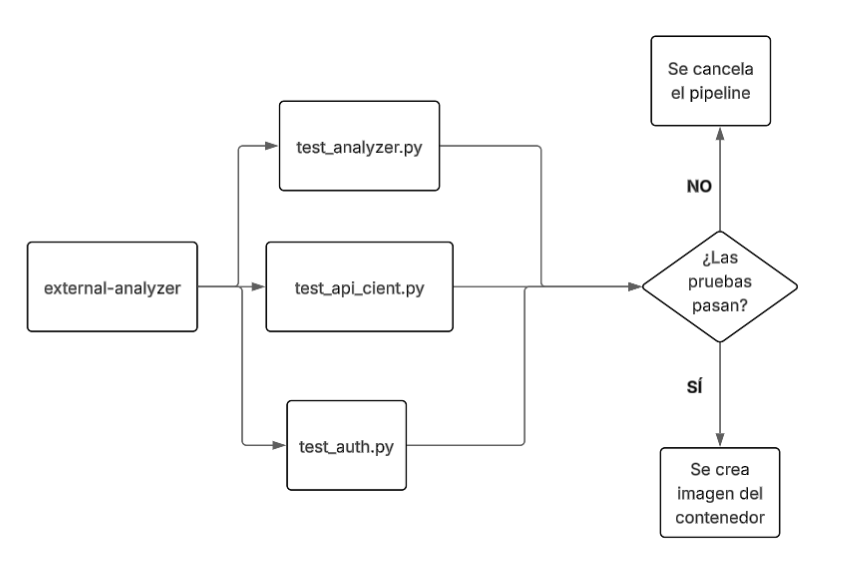

# Final_DS_AlanyaCampos

### `Pregunta1/`

En esta carpeta se encuentras los tests, usando mocks, patch y fixtures

#### `test_api_client.py`

Test donde se aplica patch, que permite reemplazar el requests.get con un mock para simular una respuesta de la API sin tener que hacer un request real.

#### `test_auth.py`

Se crea un fixture, `user_fixture`, que devuelve información básica de un usuario cualquiera.

Luego, se crea otro fixture, `authenticated_client_fixture`, que depende del anterior y que devuelve el cliente autenticado.

### `Pregunta2/`

En esta carpeta se crea un archivo Dockerfile, donde se copia el código desarrollado en la carpeta `Pregunta1`, además se agrega el archivo `.dockerignore` para que, al momento de crear la imagen de docker, se ignoren ciertos archivos o directorios.

### Pipeline

Se crea el pipeline `ci.yml`, dentro de `.github/workflows/`. 

En este pipeline, se verificarán que haya comentarios en español (usando palabras comunes). Además se agrega un step para detectar patrones hechos por IA (nuevamente usando palabras clave).

Por último, también se agregan steps que ejecuten los tests, y si todos pasan, entonces se crea la imagen del contenedor (condición del problema).

### Diagrama

<div align = "center">
    
</div>


### Pasos para ejecutar el proyecto

**0.** Clonar el repositorio

```
git clone https://github.com/AlbeCamp21/Final_DS_AlanyaCampos.git
```

**1.** Crear entorno virtual e instalar dependencias:

```
# En la raiz del proyecto
python -m venv venv
pip install -r requirements.txt
```

**2.** Probando tests:

```
# En la raiz del proyecto
pytest -v
```

**3.** Levantando el contenedor

```
# En la raiz del proyecto
docker build --tag contenedor_pregunta1 -f Pregunta2/Dockerfile .
docker run -it contenedor_pregunta1
```

**4.** Verificando que el código esté en el contenedor

```
# Estando en el contenedor
ls
```